High-level architecture (Mermaid)

```mermaid
flowchart LR
  SIEM[SIEM Alerts] --> NP[NormalizationPipeline]
  NP --> EN[Enrichment Providers]
  EN --> PL[Planner]
  PY[PythonThreatScorerClient] --> TA[ThreatAssessment]
  TA --> PL

  PL --> PO[PolicyEngine]
  PO --> PD[PolicyDecision]
  PO -.-> AW[ApprovalWorkflow<br/>(creates approval requests)]

  PD --> EX[ExecutionPipeline]
  EX --> AL[IAuditLogger<br/>(JSONL / InMemory)]
  AL --> AP[IAuditPipeline<br/>(Reports)]

  PD --> CM[CaseManager (optional)]
  EX --> CM
  CM --> AL
```

Class diagram (Mermaid)

```mermaid
classDiagram
  %% --- Normalization / Enrichment ---
  class INormalizationPipeline {
    +ProcessAsync(raw: RawAlert, ct): EnrichedAlert
    +Normalize(raw: RawAlert): NormalizedAlert
    +EnrichAsync(normalized: NormalizedAlert, ct): EnrichedAlert
  }
  class NormalizationPipeline
  INormalizationPipeline <|.. NormalizationPipeline

  class IMappingRegistry
  class IAlertMapper
  class IAlertValidator
  class IEnrichmentProvider
  class IEnrichmentMerger

  NormalizationPipeline --> IMappingRegistry
  NormalizationPipeline --> IAlertValidator
  NormalizationPipeline --> IEnrichmentProvider
  NormalizationPipeline --> IEnrichmentMerger
  IMappingRegistry --> IAlertMapper

  %% --- Planning ---
  class Planner {
    +Plan(alert: EnrichedAlert, assessment: ThreatAssessment, ctx: PlanningContext): DecisionPlan
  }
  class IStrategySelector
  class IActionSelector
  class IRiskEstimator
  class IActionSanitizer
  class IActionNormalizer
  class IRollbackBuilder
  class ActionCatalog {
    +Get(type: ActionType): ActionDefinition
    +TryGet(type: ActionType, out def): bool
  }
  class DecisionPlan
  class PlannedAction

  Planner --> IStrategySelector
  Planner --> IActionSelector
  Planner --> IRiskEstimator
  Planner --> IActionSanitizer
  Planner --> IActionNormalizer
  Planner --> IRollbackBuilder
  Planner --> ActionCatalog
  DecisionPlan --> PlannedAction

  %% --- Policy / Approvals ---
  class PolicyEngine {
    +Evaluate(plan: DecisionPlan, assessment: ThreatAssessment, alert: EnrichedAlert?, ctx: PlanningContext): PolicyDecision
  }
  class PolicyConfig
  class ApprovalWorkflow
  class PolicyDecision
  class PolicyActionDecision
  class ApprovalRequest

  PolicyEngine --> PolicyConfig
  PolicyEngine --> ApprovalWorkflow
  PolicyEngine --> ActionCatalog
  PolicyEngine --> PolicyDecision
  PolicyDecision --> PolicyActionDecision
  ApprovalWorkflow --> ApprovalRequest

  %% --- Execution ---
  class IExecutionPipeline {
    +ExecuteAsync(alert: EnrichedAlert, assessment: ThreatAssessment, plan: DecisionPlan, policy: PolicyDecision, ctx: ExecutionContext, ct): ExecutionReport
  }
  class ExecutionPipeline
  IExecutionPipeline <|.. ExecutionPipeline

  class IExecutorRouter
  class IActionExecutor
  class ExecutionReport
  class ActionResult
  class ExecutionContext
  class FeasibilityResult

  ExecutionPipeline --> IExecutorRouter
  IExecutorRouter --> IActionExecutor
  ExecutionPipeline --> IAuditLogger
  ExecutionPipeline --> ExecutionReport
  ExecutionReport --> ActionResult

  %% --- Auditing ---
  class IAuditLogger {
    +Log(entry: AuditEntry): string
  }
  class JsonlFileAuditLogger
  class InMemoryAuditLogger
  IAuditLogger <|-- JsonlFileAuditLogger
  IAuditLogger <|-- InMemoryAuditLogger

  class IAuditPipeline {
    +BuildReportAsync(query: AuditQuery, ct): AuditReport
  }
  class JsonlAuditPipeline
  IAuditPipeline <|-- JsonlAuditPipeline

  %% --- Python scoring ---
  class PythonThreatScorerClient
  class ThreatAssessment
  PythonThreatScorerClient --> ThreatAssessment
```


